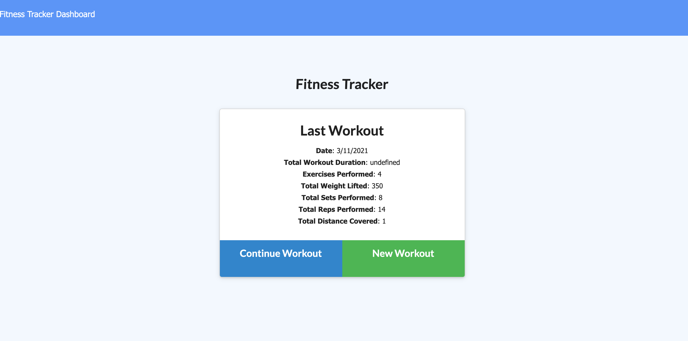
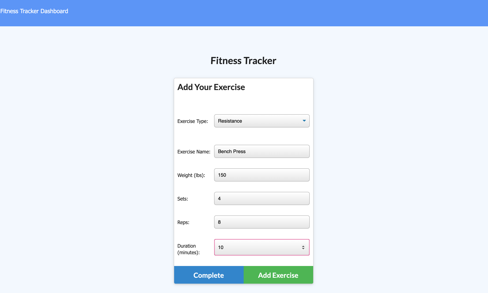

# Workout Tracker

## Table of Contents
* [Description](#description)
* [URL](#url)
* [Installation](#installation)
* [License](#license)
* [Contributing](#contributing)
* [Questions](#questions)
## Description 
A fitness app that allows the user to view, create, and track daily workouts. The user is able to log multiple exercises in a given day and also go back and update the workout. The user is able to track the name, type, weight, sets, reps and duration of each exercise. Cardiovascular exercises show the distance traveled in miles.
## URL
[Click here to see the live site!](https://nameless-everglades-85073.herokuapp.com/)
[Click here to see video dementration](https://drive.google.com/file/d/1Q--q1ETs1mkzlJnFkIwHPzh2Gxa89rns/view?usp=sharing)

## Installation
 Download the repo to your machine, be sure to run npm i in the root directory and to also have MongoDB installed and ready.

## Contributing
Anyone is welcome to add on this project. I can be reached at the email below with any questions related to working on this project.

## Questions
Please contact me below with any questions you have about the appiction.
* Github: https://github.com/lindseybowen
* Email: lindseyjbowen@gmail.com